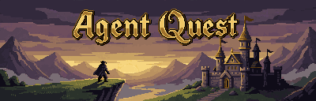
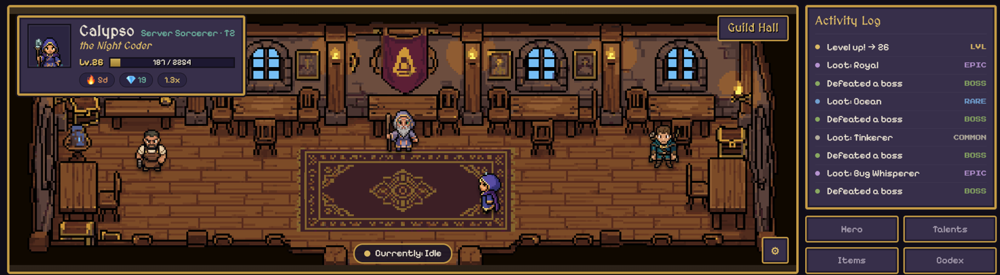

<h1 align="center">
  <a href="https://github.com/Hin-Nattapat/agent-quest">
    
  </a>
</h1>

<h3 align="center">Your AI coding sessions, gamified into a retro pixel RPG.</h3>

<p align="center">
  <em>You were going to burn those Claude tokens anyway. Might as well level up.</em>
</p>

<p align="center">
  <a href="https://marketplace.visualstudio.com/items?itemName=NattaP.agent-quest"></a>
  <a href="LICENSE"></a>
  
  
  
</p>

<p align="center">
  🛒 <a href="https://marketplace.visualstudio.com/items?itemName=NattaP.agent-quest">Marketplace</a>
  &nbsp;•&nbsp; 📦 <a href="#-install">Install</a>
  &nbsp;•&nbsp; 🧙 <a href="#-how-it-works">How it works</a>
  &nbsp;•&nbsp; 🐛 <a href="https://github.com/Hin-Nattapat/agent-quest/issues">Issues</a>
  &nbsp;•&nbsp; ☕ <a href="#-support">Support</a>
  &nbsp;•&nbsp; 📜 <a href="LICENSE">License</a>
</p>

<p align="center">
  
</p>

---

Agent Quest turns every Claude Code session into character progression. As you prompt, edit, run
commands and ship code, a hook pipeline records the session as an append-only event journal, folds it
into an RPG character — class, level, XP, streak, loot, boss fights, achievements — and shows it in a
**live pixel-art companion panel** inside VS Code (plus a one-line status-bar HUD).

It's **ambient and read-only**: you never operate it as a task. You glance at it between turns and it
feels good. Think a beloved old 2D-MMO HUD (Tibia / RuneScape era) sitting quietly next to your code,
quietly judging your commit messages.

> **🍿 Why does this exist?**
> A developer was watching Claude Code chew through a token budget on a perfectly real task and
> thought: *"what if all this grinding actually leveled something up?"* Several thousand tokens of
> world-class yak-shaving later, here we are. The mage in the screenshot above is real — she gained
> most of a level while this README was being written. We regret nothing.

## ✨ Features

- 🧙 **A character that levels with your work** — Mage · Ranger · Rogue · Sage (+ secret lines you
  unlock by being weird), advancing through tiers T1→T4 with branching forms. Earned from real session
  events, not a progress bar that just goes up because you opened the editor.
- 🪙 **Loot, boss fights & achievements** — rate-based encounters drop gear; medieval "deeds" unlock
  equippable titles like *the Night Coder*. No random theater — every drop traces back to an event.
- 🏰 **An animated AFK scene** — your hero farms, rests in the **guild hall** (now with loitering
  NPCs), and battles through tier realms. Real pixel sprites for all four main class lines.
- 📊 **Status-bar HUD** — `Lv.N ███░░ %  ·  model  ·  $cost  ·  ctx %` right in the Claude Code status
  line, for when the panel is too much commitment.
- 🔌 **Genuinely clean architecture** — agent-awareness lives only in adapters (Claude Code, Codex,
  Cursor, and Copilot today); the engine is a pure reducer over a normalized event contract. Runtime
  dependencies: `bun` + `jq`. No `node_modules` black hole.

## 📋 Requirements

- [Claude Code](https://claude.com/claude-code) — the thing generating the events (Codex, Cursor, and Copilot
  work too, via their own adapters)
- [Bun](https://bun.sh) and [`jq`](https://jqlang.github.io/jq/) on your `PATH`
- [VS Code](https://code.visualstudio.com/) — for the companion panel

## 📦 Install

*(This is the part with no jokes. We take installation seriously.)*

**Homebrew** (macOS / Linux):

```bash
brew install Hin-Nattapat/agent-quest/agent-quest
aq setup
```

`brew install` puts the `aq` command on your `PATH`; `aq setup` deploys the engine to
`~/.agentrpg` on first run and then wires your coding agent(s). Re-run `aq setup` after a
`brew upgrade` to refresh the deployed engine.

**1 — Install the engine** (hooks + reducer + CLI):

```bash
curl -fsSL https://raw.githubusercontent.com/Hin-Nattapat/agent-quest/main/scripts/bootstrap.sh | bash
```

This clones the repo, deploys into `~/.agentrpg`, and prints a Claude Code settings snippet.

**Choose your agent(s).** By default the installer wires Claude Code. To pick others (Codex,
Cursor, Copilot) or to let it merge the config for you automatically:

```bash
# interactive — detects installed agents and asks
bash tools/install.sh

# non-interactive (also works piped):
curl -fsSL …/bootstrap.sh | bash -s -- --agent claude-code,cursor --apply --hud
```

`--apply` merges the wiring into each agent's config (writing a `.bak` first); without it the
installer just prints the snippet to paste. `--hud` / `--no-hud` controls the Claude Code
statusline (other agents render via the companion panel). Re-run the picker any time with
`aq setup`.

**2 — Wire Claude Code:** merge the printed `hooks` + `statusLine` snippet into
`~/.claude/settings.json`.

**3 — Install the companion panel:** search **"Agent Quest"** in the VS Code Extensions view, or:

```bash
code --install-extension NattaP.agent-quest
```

Reload the window, start a Claude Code session, and open the **Agent Quest** panel (next to Terminal /
Output). It updates live as you work. That's the whole setup.

<details>
<summary>Prefer to install from source / build the extension yourself?</summary>

```bash
git clone https://github.com/Hin-Nattapat/agent-quest && cd agent-quest
bash tools/install.sh            # deploy engine to ~/.agentrpg (then merge the printed snippet)
cd app/extension && npm install && npm run reinstall   # build + install the .vsix locally
```

</details>

## 🧙 The character

You start at **Level 1, Novice**, like everyone else who's ever been humbled by a fresh repo. Real
work earns XP and pushes you up the tiers:

| Tier | Vibe |
| --- | --- |
| **T1–T3** | Pick a line (Mage / Ranger / Rogue / Sage) and grind it out. |
| **T4** | Your line **branches** into two ascended forms. Choose wisely (or don't, it's pixels). |
| **Secret lines** | Unlocked by unusual play patterns. We're not telling you how. |

Bosses spawn at a tuned rate, drop loot, and occasionally flee in terror. Achievements are medieval
"deeds" that unlock **equippable titles**. The picture you see is driven by tier — the numbers are
driven by what you actually did.

## 🔌 How it works

```
agents ──(adapters)──► append-only journal (NDJSON) ──(reducer)──► state.json ──► HUD / companion
```

- **Adapters** (`adapters/<agent>/hooks/*.sh` — Claude Code, Codex, Cursor, Copilot) are the only agent-aware
  code. They run on the agent's hot path, stay tiny, and append one normalized event per line to a
  per-session journal.
- The **reducer** (`core/`) folds the journal into `state.json` — a pure function over the event
  contract in `core/events.ts`. It knows nothing about Claude Code, and likes it that way.
- The **companion** (`app/`, React + Vite) and the **status-bar HUD** (`hud/`) are read-only consumers
  of `state.json`. The companion ships as a VS Code webview extension (`app/extension/`).

Want it to count another agent? Write a new adapter. The engine and UI never change — that's the whole
point of the seam.

## 🛠️ Tech stack

Bun + TypeScript (engine, run directly — no transpile step) · `jq` (hook JSON) · React 19 + Vite
(companion) · esbuild + `@vscode/vsce` (extension). **Runtime dependencies: `bun` and `jq`.** That's
the list. We checked twice.

## ⚠️ Known limitations

- Single developer, single machine. Progression is local and meant to be _grinded_ — there's no
  backfill, because instantly jumping to Level 40 would defeat the entire bit.
- **Multi-agent, but Claude Code is the one that's actually grinded.** Adapters ship for Claude Code,
  Codex, Cursor, and Copilot — same journal, same hero. Claude Code is what I daily-drive, so it's the most
  battle-tested; the others are built to the same contract but see less mileage.
- `--continue` / `--resume` replay recorded hook output and don't re-run hooks, so resumed spans can be
  sparse. We know. It's on the list.

> **🦦 Cursor users, an otter needs you.** Full confession: I don't use Cursor. I built the adapter,
> unit-tested every hook, and shipped it on pure vibes — it has never met a real Cursor session in the
> wild, because I'm an otter who codes in Claude Code and feeds all his coffee to a robot. So this part
> is *genuinely* untested out there. If Cursor is your natural habitat, please [kick the
> tires](https://github.com/Hin-Nattapat/agent-quest/pulls) and tell me what exploded (PR or
> [issue](https://github.com/Hin-Nattapat/agent-quest/issues)). Land a fix and you get a changelog
> credit, an otter's undying gratitude, and — fine — a sprite. 🧙

## ☕ Support

Agent Quest is free and built in spare cycles. If it made your grind a little more fun, you can buy
me a coffee — it directly funds more sprites, more realms, and more tokens to grind into this thing.

<p align="center">
  <a href="https://buymeacoffee.com/natta_p"></a>
</p>

## 🤝 Contributing

Issues and PRs welcome. Architecture rules live in [`CLAUDE.md`](CLAUDE.md); the command cheat sheet is
in [`docs/reference/commands.md`](docs/reference/commands.md). Run the suite with `bun test` before you
open a PR, and your future self will thank you.

Publishing the companion to the Marketplace? See [`docs/reference/publishing.md`](docs/reference/publishing.md).

## 📜 License

[MIT](LICENSE) — do what you want, just don't blame us when your character out-levels your actual side
project.

---

<p align="center"><sub>Built with leftover Claude tokens, between real tasks. 🧙</sub></p>
